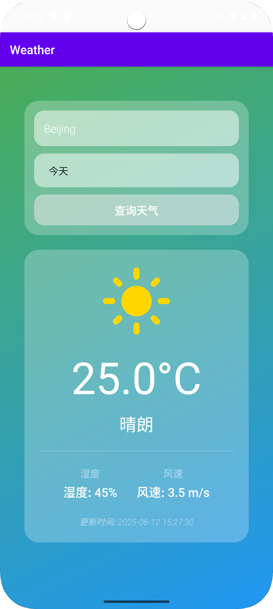

# 天气应用 (Weather App)

一个现代化的 Android 天气应用，提供实时天气信息和优雅的用户界面。



## 功能特性

### 1. 城市天气查询
- 支持全球任意城市天气查询
- 支持中英文城市名称输入
- 实时获取最新天气数据
- 支持今天、明天、后天天气查看

### 2. 网络请求模块
- 使用 OkHttp 发起网络请求
- 调用 OpenWeatherMap API 获取天气数据
- JSON 数据解析与处理
- 网络请求异常处理

### 3. 天气信息展示
- 显示城市名称和当前温度
- 展示天气状况和天气图标
- 显示湿度和风速信息
- 支持下拉刷新更新数据

### 4. 数据缓存功能
- 使用 SQLite 数据库存储历史数据
- 优先从本地读取缓存数据
- 自动更新过期数据
- 减少重复网络请求

### 5. 用户界面设计
- 现代化磨砂玻璃界面
- 动态渐变背景效果
- 优雅的字体层次设计
- 响应式布局适配

### 6. 天气图标系统
- 本地化天气图标映射
- 支持多种天气状态显示
- 优化图标加载性能
- 提升离线使用体验

### 7. 开发计划功能
- [ ] 多语言支持
- [ ] 天气预警功能
- [ ] 天气趋势图表
- [ ] 自定义主题
- [ ] 天气分享功能
- [ ] AI 穿衣建议
- [ ] 城市收藏管理
- [ ] 小时级天气预报

## 技术架构

### 开发环境
- Android Studio Hedgehog | 2023.1.1
- Kotlin 2.0.21
- Gradle 8.10.0
- minSdk 26 (Android 8.0)
- targetSdk 35 (Android 15)

### 主要依赖
```gradle
// 核心依赖
implementation 'androidx.core:core-ktx:1.16.0'
implementation 'androidx.appcompat:appcompat:1.6.1'
implementation 'com.google.android.material:material:1.11.0'
implementation 'androidx.constraintlayout:constraintlayout:2.1.4'
implementation 'androidx.swiperefreshlayout:swiperefreshlayout:1.1.0'

// 网络请求
implementation 'com.squareup.okhttp3:okhttp:4.12.0'

// JSON 解析
implementation 'org.json:json:20231013'

// 数据存储
implementation 'androidx.sqlite:sqlite-ktx:2.4.0'

// 图表库
implementation 'com.github.PhilJay:MPAndroidChart:v3.1.0'
```

### 项目结构
```
app/
├── src/
│   ├── main/
│   │   ├── java/com/example/weather/
│   │   │   ├── MainActivity.kt          # 主界面
│   │   │   ├── model/
│   │   │   │   └── WeatherData.kt       # 天气数据模型
│   │   │   ├── network/
│   │   │   │   └── WeatherApi.kt        # 网络请求
│   │   │   └── db/
│   │   │       └── WeatherDbHelper.kt   # 数据库操作
│   │   ├── res/
│   │   │   ├── layout/
│   │   │   │   └── activity_main.xml    # 主界面布局
│   │   │   ├── drawable/
│   │   │   │   ├── gradient_background.xml  # 渐变背景
│   │   │   │   ├── frosted_glass.xml    # 磨砂玻璃效果
│   │   │   │   └── frosted_card.xml     # 卡片背景
│   │   │   └── values/
│   │   │       ├── colors.xml           # 颜色资源
│   │   │       └── themes.xml           # 主题样式
│   │   └── AndroidManifest.xml
│   └── test/                            # 测试代码
└── build.gradle.kts                     # 应用级构建配置
```

## 关键设计思路

### 1. 界面架构设计
- 使用 Activity 作为主入口，统一管理界面生命周期
- 采用 ViewBinding 简化 UI 控件绑定，提升代码可维护性
- 使用 ConstraintLayout 实现响应式布局，适配不同屏幕尺寸
- 通过 CardView 实现磨砂玻璃效果的卡片式设计

### 2. 数据交互设计
- 使用 OkHttp 实现网络请求模块，调用 OpenWeatherMap API
- 采用 JSON 解析处理天气数据，转换为实体类对象
- 使用 SQLite 数据库实现本地数据缓存
- 通过协程处理异步操作，确保主线程流畅性

### 3. 用户交互设计
- EditText + Button 组合实现城市搜索功能
- TextView + ImageView 展示天气信息与图标
- SwipeRefreshLayout 实现下拉刷新更新数据
- Spinner 实现日期选择功能

### 4. 性能优化设计
- 本地缓存减少重复网络请求
- 异步处理避免主线程阻塞
- 图片资源本地化提升加载速度
- 响应式布局优化不同设备体验

### 5. 扩展性设计
- 模块化架构便于功能扩展
- 预留多语言支持接口
- 支持自定义主题切换
- 预留 AI 功能集成接口

### 6. 开发计划设计
- [ ] 集成 Room 数据库优化数据存储
- [ ] 添加 RecyclerView 展示天气预报列表
- [ ] 实现 ChipNavigationBar 底部导航
- [ ] 集成 OpenAI GPT API 实现智能推荐
- [ ] 优化 ViewBinding 使用规范
- [ ] 完善协程异步处理机制

## 安装说明

1. 克隆项目
```bash
git clone https://github.com/WilliamZ1008/Weather.git
```

2. 在 Android Studio 中打开项目

3. 获取 OpenWeatherMap API 密钥
   - 访问 [OpenWeatherMap](https://openweathermap.org/)
   - 注册账号并获取 API 密钥
   - 在 `WeatherApi.kt` 中替换 `apiKey` 变量

4. 构建并运行项目
```bash
./gradlew assembleDebug
```

## 使用说明

1. 启动应用后，默认显示西安市的天气信息
2. 在输入框中输入城市名称（支持中英文）
3. 选择要查看的日期（今天/明天/后天）
4. 点击"查询天气"按钮获取最新天气
5. 下拉可以刷新天气数据

## 界面预览

应用采用现代化的设计风格：
- 渐变背景：从蓝色到绿色的渐变效果
- 磨砂玻璃效果：半透明卡片设计
- 优雅的字体：使用不同字重的字体层次
- 响应式布局：适配各种屏幕尺寸

## 开发计划

- [ ] 添加多语言支持
- [ ] 实现天气预警功能
- [ ] 添加天气趋势图表
- [ ] 支持自定义主题
- [ ] 添加天气分享功能

## 贡献指南

1. Fork 项目
2. 创建特性分支 (`git checkout -b feature/AmazingFeature`)
3. 提交更改 (`git commit -m 'Add some AmazingFeature'`)
4. 推送到分支 (`git push origin feature/AmazingFeature`)
5. 创建 Pull Request

## 许可证

本项目采用 MIT 许可证 - 查看 [LICENSE](LICENSE) 文件了解详情

## 联系方式

如有问题或建议，请提交 Issue 或 Pull Request。

## 致谢

- [OpenWeatherMap](https://openweathermap.org/) - 天气数据 API
- [MPAndroidChart](https://github.com/PhilJay/MPAndroidChart) - 图表库
- [OkHttp](https://square.github.io/okhttp/) - 网络请求库 